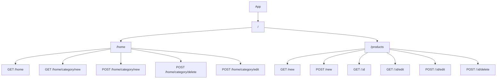

This project requires a postgresql database

## Stack
- Database: Postgresql
- Backend: Node.js and Express
- Frontend: HTML and CSS

flowchart LR

Client --> Server

Server --> Root["/"]

Root --> Index["/index"]
Root --> Products["/products"]

db folder is for setting up the database and making sure
the database is as expected.

pool is used to query said data based off the app's needs.

see .env.sample to see expected .env setup

App follows the MVC pattern

Uses express 5.xx automatic error handling for controllers.

flowchart TD

App["Express App"]

App --> Root["/"]
App --> Products["/products"]
App --> Categories["/categories"]

Root --> Home["GET /"]
