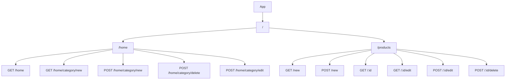

# Inventory App
- This is a CRUD app built following the TOP curriculum
- App is designed to showcase understanding of modern backend design
- App follows the MVC design system

## Stack
- Database: Postgresql
- Backend: Node.js and Express
- Frontend: HTML and CSS

- Note Express Version 5.xx + required to run application

```mermaid
flowchart TD

App --> Root["/"]

Root --> Index["/home"]
Root --> Products["/products"]

Index --> I1["GET /home"]
Index --> I2["GET /home/category/new"]
Index --> I3["POST /home/category/new"]
Index --> I4["POST /home/category/delete"]
Index --> I5["POST /home/category/edit"]

Products --> P1["GET /new"]
Products --> P2["POST /new"]
Products --> P3["GET /:id"]
Products --> P4["GET /:id/edit"]
Products --> P5["POST /:id/edit"]
Products --> P6["POST /:id/delete"]  

```

## Setup
To run locally you'll need to install and setup a postgresql database.
Create a .env file following .env.sample for setup.

If you already have a postgresql connection string you 
can connect it to the app through MSG_URL environment variable.

Once .env file is setup run "npm run start" to run the server.
